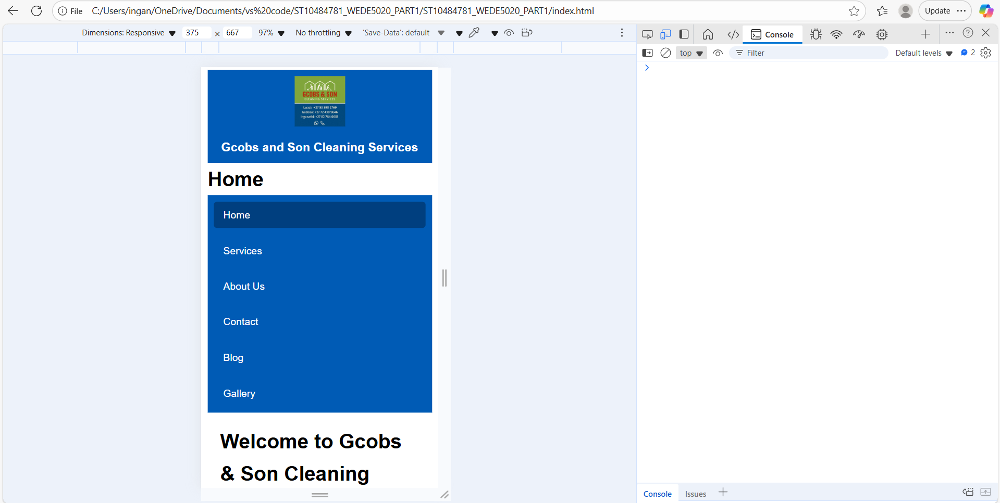

# ST10484781_WEDE5020_PART3
## Overview
Designing the cleaning service website was a step-by-step affair, beginning with a proposal articulating the need for a professional website to advertise services, become credible, and acquire customers. In the planning stage, the focus was on developing a clean and professional look with HTML as the structure and CSS as the style to make it a clean and modern look that responds. The website had primary pages that included a homepage, services, about, contact, and blog, all with specific functions of showcasing offerings, providing company background, facilitating communication, and providing cleaning tips to establish expertise. The website used neutral colors, rounded corners, and minimalistic elements to convey professionalism and trust. Issues such as inconsistent filenames and problems with homepages loading were solved during implementation through standardized filenames and navigation links. The final result is a working, nice-looking site that conveys the business's identity, highlights its services, and involves clients through content accessibility and interactivity.

---

## Screenshots
Screenshots of the website tested on different devices and screen sizes:

### Desktop View
 

### Tablet View

### Mobile View

---

## SEO Implementation
Each HTML page contains:
- Unique `<title>`, `<meta description>`, and `<meta keywords>` tags.  
- Correct `<h1>`, `<h2>`, `<h3>` hierarchy for headings.  
- Descriptive `alt` text for all images.  
- Clean, descriptive filenames (e.g., `about.html`, `services.html`).  
- Responsive and mobile-friendly design.  

Extra SEO files:
- **robots.txt** – controls crawler access.  
- **sitemap.xml** – lists all site pages for indexing.  

---

## JavaScript Functionality
- **Form Validation:** Ensures all fields are correctly completed before submission.  
- **Success Notification:** Displays a message confirming successful submission for both Contact and Enquiry forms.  
- **Lightbox Gallery:** Enlarges images when clicked for a better viewing experience.  
- **Transitions and Animations:** Smooth hover and button effects using CSS and JS.  

---

## Changelog

### Part 1 → Part 2 Changes
- Added external CSS folder and linked all pages.  
- Created responsive layouts using Flexbox and Grid.  
- Improved color scheme (blue & white).  
- Fixed alignment of logo (left) and company name (right).  
- Added consistent navigation across all pages.

### Part 2 → Part 3 Changes
- Added JavaScript validation to **contact** and **enquiry** forms.  
- Implemented success notification messages after form submission.  
- Added **robots.txt** and **sitemap.xml** for SEO.  
- Enhanced **SEO meta tags** on all pages.  
- Integrated **Google Map** showing 5241 Extension 6, Grahamstown.  
- Implemented **gallery lightbox** functionality.  
- Improved **animations and transitions** for smoother interaction.  
- Updated responsive design for mobile and tablet.  
- Added all changes to **README.md** with screenshots.

---

---

## Future Improvements
- Add an online payment system for bookings.  
- Create a blog content management section.  
- Improve accessibility features for all users.

---

## References
Brown, T. (2020) *The role of online presence in small business growth.* Cape Town: SA Business Press.  
Chaffey, D. & Ellis-Chadwick, F. (2019) *Digital Marketing: Strategy, Implementation and Practice.* 7th edn. Harlow: Pearson.  
Jones, M. (2022) *Digital marketing strategies for service-based businesses.* Johannesburg: BizTech Publications.  
Smith, R. (2021) ‘How consumers find and choose local businesses’, *Journal of Digital Commerce,* 14(3), pp. 45–52.  

---

## GitHub Repository
> [https://github.com/YourUsername/ST10484781_WEDE5020_PART3](https://github.com/YourUsername/ST10484781_WEDE5020_PART3)

